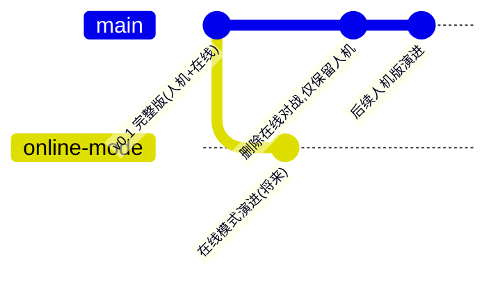

# 代码提交与分支管理方案

## 平台与总体思路

- 托管到 **Cursor 托管仓库**（origin.cursor.com，私有），我可全自动创建并推送，无需注册账号。
- 分支策略（简单双分支，适合单人项目）：
  - **`main`**：主线分支 = 纯人机对战版，之后的演进和推广都在这里进行。
  - **`online-mode`**：完整版快照（人机 + 在线对战），冻结保存；将来要做在线模式时在此分支继续演进，并可随时把 main 上的改进 merge 过来。
- 提交顺序保证在线代码先被完整保存，再做删减：

## 实施步骤

1. **建仓与首次提交**：`git init`，用现有 [.gitignore](.gitignore)（已排除 node_modules/dist），全量提交到 `main`，提交信息注明"完整版：人机对战 + 在线对战"，并打标签 `v0.1-online` 便于回溯。
2. **创建保存分支**：在该提交上创建 `online-mode` 分支（不切换，仅指针）。
3. **在 main 上删除在线对战**：
   - 删目录/文件：`server/`、`src/online/`、[tsconfig.server.json](tsconfig.server.json)、`启动联机服务器.bat`、[scripts/start-server.ps1](scripts/start-server.ps1)、[scripts/smoke-online.mjs](scripts/smoke-online.mjs)
   - [src/App.tsx](src/App.tsx)：删 `online` 界面分支；[src/ui/Lobby.tsx](src/ui/Lobby.tsx)：删"在线对战"面板与 `onOnline` 入口
   - [vite.config.ts](vite.config.ts)：删 `/ws` 代理与 server 测试 include
   - [package.json](package.json)：删 `ws`、`tsx`、`@types/ws`、`@types/node` 依赖与 `server` 脚本，build 脚本去掉 server 类型检查
   - [README.md](README.md) 与 [依赖清单.md](依赖清单.md)：删在线对战章节与相关依赖说明
   - `src/core` 引擎不动（`abandon` 结束原因保留，减少两分支将来合并时的冲突）
   - styles.css 中 online 专用样式一并删除
4. **验证后提交**：`npm install`（收敛依赖）、`tsc`、全部 vitest、`npm run build` 通过后，在 `main` 提交"删除在线对战，仅保留人机对战"。
5. **创建远程并推送**：按 Cursor 托管仓库流程（origin CLI）创建私有仓库，推送 `main`、`online-mode` 两个分支与标签。

## 日常使用建议（完成后）

- 人机版日常改动：直接在 `main` 提交，`git push` 备份。
- 将来恢复在线演进：`git switch online-mode`，先 `git merge main` 吸收人机版改进，再继续开发。