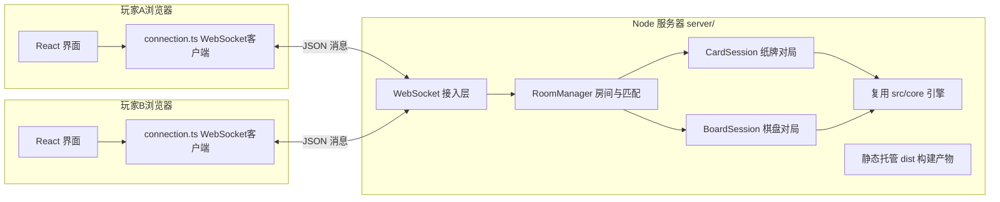

# 龙虎斗在线对战：前后端设计方案

## 一、总体架构

采用**权威服务器**模型：服务器持有唯一真实的对局状态，所有着法由服务器用现有引擎（[src/core/cardGame.ts](src/core/cardGame.ts)、[src/core/boardGame.ts](src/core/boardGame.ts)）校验和结算，客户端只负责渲染与提交意图。这样天然防作弊（纸牌的暗出牌、棋盘的暗牌身份都不会提前发给对方），也是未来公网部署的正确基础。

- 技术栈：Node + `ws` 库，用 `tsx` 直接运行 TS（与前端共用一份 `package.json`，新增依赖 `ws`、`tsx`、`@types/ws`）。
- **单端口部署**：服务器同时托管前端构建产物和 WebSocket（默认 8787 端口）。局域网玩法：一台电脑运行服务器，双方浏览器访问 `http://<主机IP>:8787` 即可，零配置；将来公网部署只需把同一个服务器进程放到云主机加 WSS。
- 消息协议与视图模型定义在 [src/online/protocol.ts](src/online/protocol.ts)，前后端共享类型，全部走 JSON。

## 二、后端设计（新增 server/ 目录）

### 房间系统（RoomManager）

房间数据：`{ id, code(4位数字), gameType('card'|'board'), players[≤2]{clientId, name, ready}, status('waiting'|'countdown'|'playing'|'finished') }`。

三种进入方式统一落到"入座"这一个动作上：

- **B 房间列表**：在线大厅实时推送所有未满员房间（游戏类型、人数、是否有人已准备），点击即入座。
- **A 房间码**：创建房间时生成 4 位数字码，另一玩家输码直接入座指定房间。
- **C 自动匹配**：按优先级为玩家挑房间——① 有一人已点准备的单人房 → ② 有一人未准备的单人房 → ③ 都没有则自动创建新房间等待。

**准备与倒计时**：两人入座后，任一方点击"准备"即启动 15 秒倒计时（服务器权威计时，倒计时截止时间广播给双方显示）；另一方超时未准备则被**踢回大厅**，席位释放、房间回到等待状态。双方都准备则立即开局。对局结束后回到入座状态，重新走准备流程即为"再来一局"。

### 对局会话

- **纸牌（CardSession）**：核心是**提交-揭示**。双方各自提交本回合暗牌，服务器收齐前只告知对方"已扣牌"，收齐后调 `playRound` 结算并同时向双方揭示。阵营首局由入座顺序定（房主执龙），每局互换。
- **棋盘（BoardSession）**：先手随机、每局互换。服务器持有完整 `BoardGameState`，但发给客户端的是**净化视图**——未翻开格子不含牌面身份（防开发者工具偷看）。翻牌结果随着法事件一起下发。客户端凭净化视图即可计算合法着法提示（翻牌合法性与暗牌身份无关，走子/吃子只涉及明牌）。
- 认输复用引擎的 `surrender` / `surrenderBoard`；服务器校验非法着法并拒绝。

### 断线与重连

客户端首次连接生成 `clientId` 存 localStorage。对局中掉线保留席位 60 秒，对方界面显示"对方掉线，等待重连"；超时判掉线方负。刷新页面可凭 `clientId` 恢复对局。

## 三、前端设计

### 新增界面（接入 [src/App.tsx](src/App.tsx) 的 Screen 路由）

- **在线大厅 OnlineLobby**：昵称输入（存 localStorage）+ 游戏类型切换（纸牌/棋盘）+ 三个入口：房间列表（实时刷新）、输入房间码加入、自动匹配按钮、创建房间按钮。
- **牌桌房间 RoomScreen**：显示房间码、双方席位与昵称、准备按钮、15 秒倒计时进度、离开房间。
- **在线对局界面**：`OnlineCardGameScreen` / `OnlineBoardGameScreen`，复用现有的 `CardView`、手牌区、结果面板、认输确认等展示组件，但状态完全由服务器消息驱动（不跑本地引擎结算）。纸牌的暗牌化体验（亮相→扣暗、弃牌区开关）与人机模式一致。

### 连接层（src/online/connection.ts）

WebSocket 客户端封装：自动重连（指数退避）、心跳、消息类型分发、连接状态供界面显示（连接中/已连接/已断开）。服务器地址默认取当前页面 host。

## 四、启动与文档

- 新增 `启动联机服务器.bat`（构建前端 + 启动服务器，打印本机局域网 IP 和访问地址）；`package.json` 加 `server` 脚本。
- 更新 README：联机玩法说明、防火墙放行提示。

## 五、测试

- RoomManager 单元测试：三种匹配方式的优先级、准备倒计时踢人、席位释放。
- 两个 Session 单元测试：提交-揭示时序、净化视图不泄漏暗牌、非法着法拒绝、认输与重连恢复。
- 现有 58 个测试保持通过。

## 实施顺序

协议与服务器核心 → 纸牌在线全链路（最先可玩）→ 棋盘在线 → 断线重连与打磨。