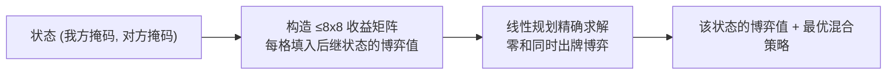

# 龙虎斗体验与 AI 优化方案

## 一、对局结束交互（去掉多余点击）

现在纸牌玩法结束需要多点一次"查看结果"，来自 [src/ui/CardGame/CardGameScreen.tsx](src/ui/CardGame/CardGameScreen.tsx) 的 `continueAfterReveal`：`reveal` 阶段必须点击才进入 `over`。

改法：`resolveRound` 里若 `next.outcome !== null`，直接累加战绩并进入结果态，最后一轮的两张牌**保留在场上不消失**，结果与"再来一局 / 返回大厅"以**页内结果面板**形式出现在出牌区下方（不再用遮罩层盖住牌面）。

棋盘玩法同步改为页内结果面板，替换当前会盖住棋盘的 `overlay`，便于复盘最终局面。

## 二、认输功能

引擎层新增投降入口，并给两个状态机加可选的 `endReason` 字段（`handEmpty` / `quietDraw` / `stalemate` / `wipeout` / `surrender`），用于结果文案与日志：

- [src/core/cardGame.ts](src/core/cardGame.ts)：`surrender(state, faction)`
- [src/core/boardGame.ts](src/core/boardGame.ts)：`surrender(state, faction)`

界面：顶栏加"认输"按钮，点击弹确认框。人机模式确认后直接判玩家负；热座模式确认框提供"龙方认输 / 虎方认输 / 取消"三个选项。结果复用第一部分的页内结果面板，文案如"龙方认输，虎方获胜"。

## 三、纸牌暗牌化与翻牌动画

- 新增开局 `preview` 阶段：双方 8 张牌全部明牌展示约 2.5 秒，然后**依次**（每张间隔约 120ms）翻转为背面。
- 之后可见性规则：人机模式下自己的手牌常亮、电脑手牌全背面；热座模式下双方手牌默认背面，仅在轮到某方选牌时该方手牌亮起，两次选牌之间沿用已有的交接遮罩。
- 弃牌区默认隐藏：每回合结算时两张牌在出牌区明牌展示约 2 秒，随后翻为背面，弃牌区只显示张数；顶栏提供"弃牌记录：隐藏/显示"开关，状态存 localStorage。
- [src/ui/CardView.tsx](src/ui/CardView.tsx) 改造为支持翻转：同时渲染正反两面，靠 CSS 3D `rotateY` + `transform-style: preserve-3d` 过渡，`faceDown` 变化即触发动画。

## 四、AI 加强

### 纸牌：精确博弈解（新增 `src/ai/cardSolver.ts`）

手牌用 8 位掩码表示，状态 = `(我方掩码, 对方掩码)`，共 65536 个。每回合至少移除一张牌，状态图无环，可按剩余总张数自底向上动态规划：

- 终局取值：双方皆空为 0，我方空为 -1，对方空为 +1。
- 求解器用紧凑单纯形法精确解小矩阵博弈（收益整体平移为正数的标准技巧）。
- 值表约 65536 个 Float32（256KB）。首次进入纸牌对局时在 Web Worker 中计算（新增 `src/ai/aiWorker.ts` 与 `src/ai/aiClient.ts`），期间显示"AI 准备中"，不支持 Worker 时同步计算兜底。之后每步只解一个小矩阵，瞬时返回。

档位改为（[src/ai/cardAI.ts](src/ai/cardAI.ts) 重新接线）：

- 困难：按精确最优混合策略抽样。因开局双方完全对称，博弈值为 0，所以玩家胜率上限就是 50%，无需调参。
- 普通：以概率 `p` 走最优策略，否则走现有启发式；`p` 作为单一可调常量，默认 0.5，实测后只调这个数。
- 简单：保留现有随机加轻微吃子偏好。

### 棋盘：加深搜索与改进估值（[src/ai/boardAI.ts](src/ai/boardAI.ts)）

- 用带时间预算的迭代加深替换固定深度（困难约 900ms、深度至 5-6；普通约 250ms），确定化样本困难档提到 12。
- 估值除现有子力外，加入机动性、己方可被吃子的悬空惩罚、对敌方的威胁奖励、克制关系保留奖励（对方 1 号在场时己方 8 号加分）。
- 搜索一并移入同一个 Worker，避免界面卡顿。

## 五、测试

- 求解器：对称开局值约为 0；`{8} vs {1}` 为 +1、`{1} vs {8}` 为 -1、同号单张为 0；终局分支齐全。
- 强度阶梯：困难/普通/简单三两配对各跑数百局自动对战，断言胜率单调（困难 > 普通 > 简单），作为回归护栏。
- 认输：两个引擎的 `surrender` 结果与 `endReason` 正确。
- 棋盘 AI：保留现有随机整局冒烟测试，新增时间预算不超限断言。

## 实施顺序

先做引擎与 AI（纯逻辑、可用测试验证），再做界面改造，最后统一样式与动画打磨。