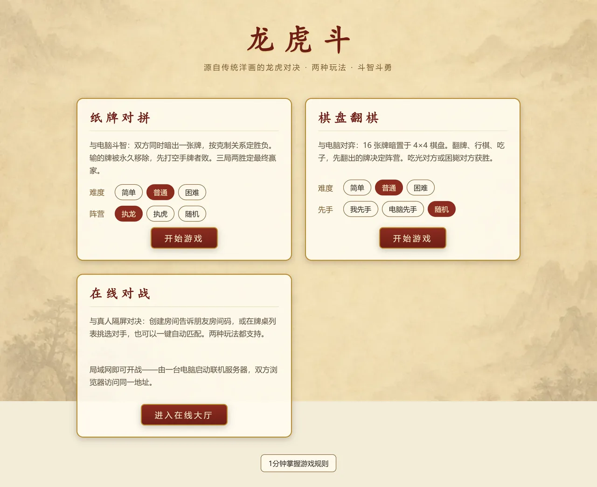
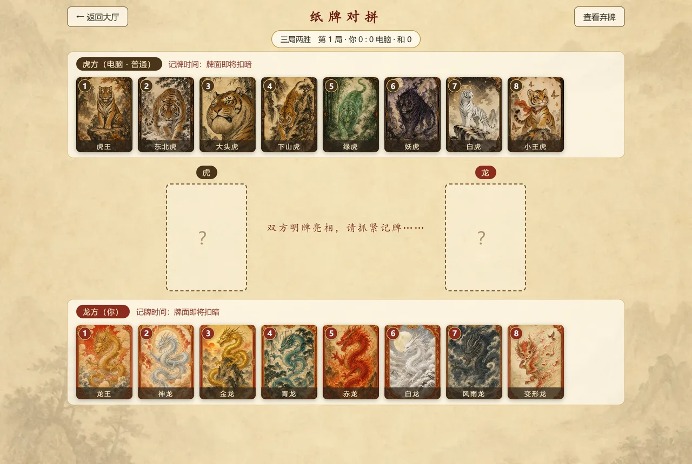
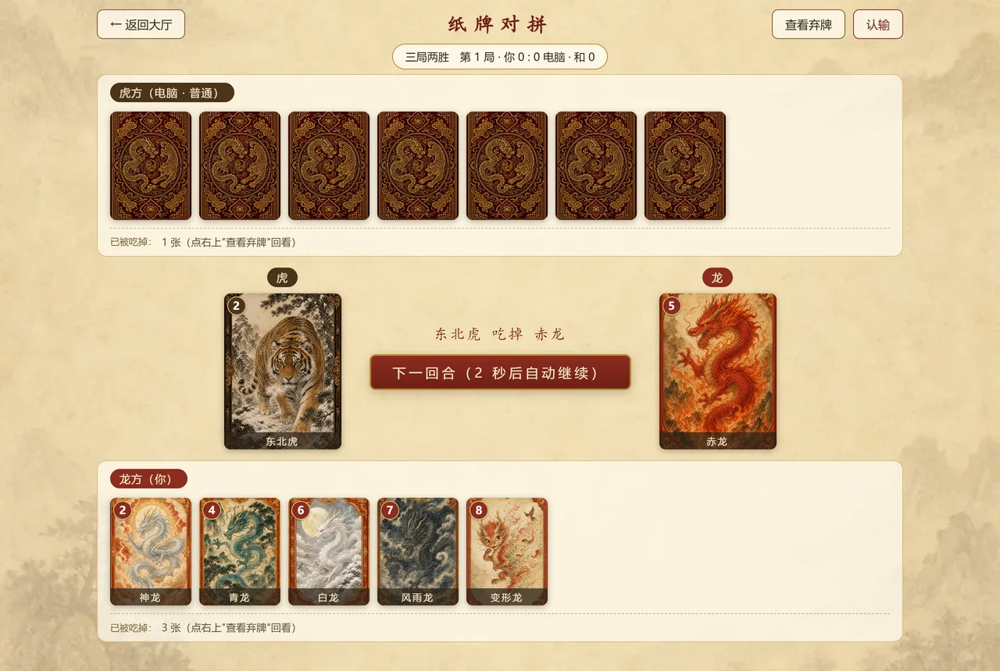
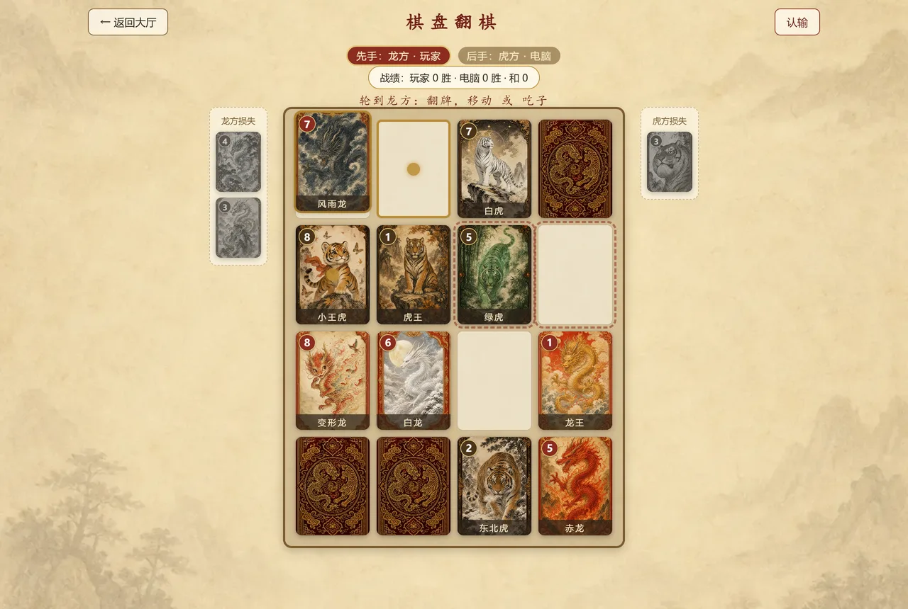
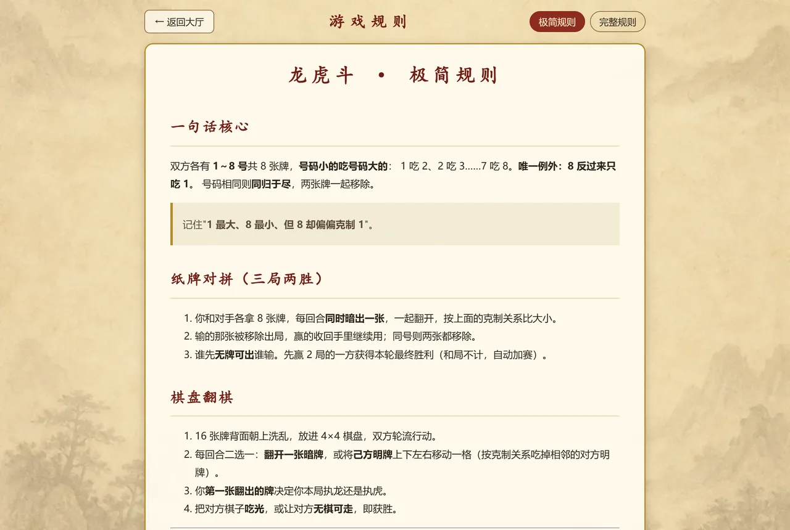

# 龙虎斗 · 桌面游戏中心

源自传统"洋画/洋牌"的双人对战游戏《龙虎斗》的网页版实现，包含两种玩法：

- **纸牌对拼**：双方同时暗出一张牌比克制关系，输方牌被移除。
- **棋盘翻棋**：4×4 棋盘上翻牌、行棋、吃子的策略对抗。

均为人机对战（三档难度 AI），无需联网。纸牌对拼采用**三局两胜**赛制（和局不计胜场，自动加赛）。

完整规则见 [龙虎斗游戏规则说明书.md](./龙虎斗游戏规则说明书.md)，想快速上手看 [极简规则](./龙虎斗极简规则.md)。

## 游戏截图

<p align="center"></p>

| 纸牌对拼 · 开局记牌 | 纸牌对拼 · 亮牌定胜负 |
| :---: | :---: |
|  |  |
| 八张牌先明牌亮相数秒，随后依次扣暗，考验记牌功力 | 双方同时暗出一张，一起翻开按克制关系定胜负 |
| **棋盘翻棋 · 中局** | **极简规则 · 1 分钟上手** |
|  |  |
| 4×4 棋盘翻牌、行棋、吃子，两侧栏记录双方损失 | 只讲核心差异化规则，看一眼就能开打 |

## 一键启动（推荐）

双击项目根目录的 **`启动游戏.bat`**。脚本会自动完成：

1. 检查 Node.js 环境（未安装或版本过低会给出提示与下载地址）；
2. 检查依赖是否已安装，未安装或依赖清单有变化则自动执行 `npm install`，已装好则跳过；
3. 启动开发服务器并自动打开浏览器。

停止游戏：在启动窗口按 `Ctrl + C`。
只想检查环境和依赖、不启动服务器时，可执行 `启动游戏.bat -CheckOnly`。

## 手动命令

```bash
npm install     # 安装依赖
npm start       # 启动游戏并自动打开浏览器
npm run dev     # 启动开发服务器（不自动开浏览器）
npm test        # 运行单元测试
npm run build   # 类型检查 + 生产构建
```

依赖说明见 [依赖清单.md](./依赖清单.md)（实际安装依据 `package.json` 与 `package-lock.json`）。

## 排查问题：打不开页面

若命令行显示服务器已启动，浏览器却提示"无法访问此网站"，多半是 IPv4/IPv6 回环地址不匹配：
Vite 默认监听 `localhost`，而 Node 在部分 Windows 机器上会把它解析成 IPv6 的 `::1`，
只监听 IPv6；浏览器访问时走 IPv4 的 `127.0.0.1`，两边错开。

项目已在 `vite.config.ts` 中显式绑定 `127.0.0.1` 规避该问题。若仍打不开，按顺序排查：

```powershell
netstat -ano | findstr "5173"     # 应看到 127.0.0.1:5173 处于 LISTENING
```

- 若监听地址是 `[::1]:5173`，说明配置未生效，确认 `vite.config.ts` 中的 `server.host` 存在；
- 若无任何监听，说明服务器没起来，查看启动窗口的报错；
- 若监听正常仍打不开，检查代理软件（系统设置中把 `127.0.0.1` 加入不使用代理的地址列表）与防火墙。

## 排查问题：日志

关键位置都有日志：规则引擎的每次翻牌/移动/吃子与胜负判定、每一次被拦截的非法着法及原因、
AI 的决策结果与耗时、界面切换与玩家操作、未捕获的运行时错误。

在浏览器按 F12 打开控制台：

```js
龙虎斗日志.打印()        // 打印本次会话全部日志
龙虎斗日志.级别('debug') // 开启详细日志（含 AI 候选着法评分、棋盘初始布局）
龙虎斗日志.导出()        // 取得纯文本，便于反馈问题时附带
龙虎斗日志.清空()
```

日志级别默认开发环境为 `info`、生产构建为 `warn`，设置后记在 localStorage 中，刷新仍生效。

## 项目结构

```
src/
├── core/        核心规则引擎与状态机（纯逻辑，无界面依赖）
│   ├── rules.ts       克制关系判定
│   ├── cardGame.ts    纸牌玩法状态机
│   └── boardGame.ts   棋盘玩法状态机
├── ai/          纸牌 AI（精确博弈求解）与棋盘 AI（PIMC 搜索），计算跑在 Web Worker
├── themes/      主题皮肤包（牌名与插画映射，规则只认阵营+编号）
└── ui/          React 界面组件
public/assets/   AI 生成的国风牌面插画
scripts/         启动脚本、牌面压缩、README 截图生成
docs/screenshots/ README 展示用的界面截图
```

> 说明：带局域网在线对战的完整版本保存在 `online-mode` 分支，
> 当前 `main` 分支为纯人机对战版（主演进方向）。

## 许可证

[MIT](./LICENSE)。可自由使用、修改、商用，保留版权声明即可。
`public/assets/` 下的牌面插画由 AI 生成，同样按 MIT 授权。
